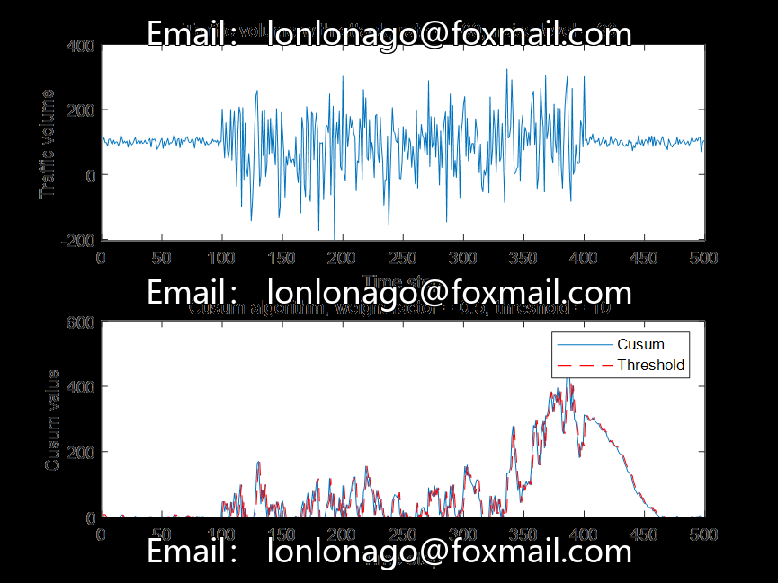

# Detecting DoS Attacks Using the Cumulative Sum Algorithm with Network Traffic Data in MATLAB R2021B

This simulation experiment employs the cumulative sum algorithm to detect DoS attacks using a network traffic dataset.

Part of the code is as follows:
%% Generate traffic using Poisson distribution
% Specify number of time steps and traffic rate
numTimeSteps = 500;
trafficRate = 100;
% Set attack parameters
attackStartTime = 100;
attackDuration = 300;
noisyLevel = 90;
% Generate traffic
trafficWithoutAttack = poissrnd(trafficRate, numTimeSteps, 1);
% Generate traffic with attack (add noise)
trafficWithAttack = trafficWithoutAttack;
trafficWithAttack(attackStartTime:attackStartTime + attackDuration) = ...
addNoise(trafficWithoutAttack(attackStartTime:attackStartTime + attackDuration), noisyLevel);

Output image:
Note:
1. All code has been tested and there are no issues.
2. Please read the work description carefully before purchasing, as it involves different programming languages (Python or MATLAB).
3. The program is a special item that cannot be returned if sold, and if there are any issues, please contact us in a timely manner.
5. This code will not be explained.

## Image

Here is a pay link on Stripe ( https://buy.stripe.com/3cs8yP7sY87d0vu9AB ). Please contact me lonlonago@foxmail.com after funding $89, and I will send you a complete data files , thank you!

